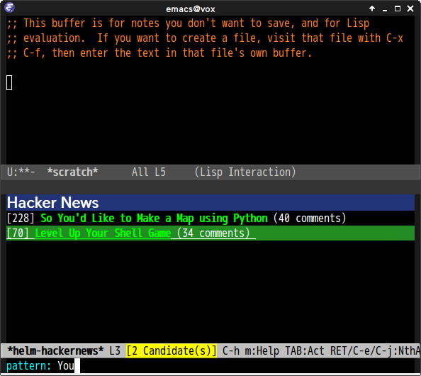

# helm-hackernews.el

## Introduction

`helm-hackernews.el` is helm interface of [hackernews](https://news.ycombinator.com/).

## Screenshot

## Requirements

* Emacs 24 or higher
* [helm](https://github.com/emacs-helm/helm) 1.0 or higher

## Commands

#### `helm-hackernews`

Show posts with helm interface
